# La MAMMA Pizza

La Mamma is an online fast food delivery B2C store, inspired by Italian cuisine, specializing in pizzas and pasta. It was built using the Django and Bootstrap frameworks.
The project was conceived entirely as an original creation, with no replication of the Boutique Ado project.

Italian cuisine, along with its colors, themes, and decorations, served as the sole inspiration for the entire design.

Authenticated users can browse through the menu, explore the flavors of pizzas, ingredients, sizes, and prices.

The project was designed to convey to the user the experience of an authentic Italian pizzeria, with carefully selected ingredients and unique flavors, making La Mamma the best pizzeria in town.

The live link can be found here - [La MAMMA Pizza](https://myecommerce-f6b06812eb2a.herokuapp.com/)

# Agile Aproach

This project was designed and built using the agile approach. To visualize the different elements of the project, I created a GitHub project and used the provided [Kanban Board](https://github.com/users/RubemJanoni/projects/7) to track the progress of my work. Project elements are assigned to different User Stories that can be opened to view Acceptance Criteria and Tasks to be completed. Additionally, each user story was labeled to indicate the priority and importance of the respective features for the overall functioning and functionality of the site

# User Experience

### Target Audience

The target audience consists of pizza enthusiasts who appreciate high-quality ingredients and seek the authentic Italian taste delivered to their doorstep

### Owner's Goal

The website owner's objective is to promote their products online, connect with their customers, and offer their delivery service.

### Customer's Goal

The customers' goal is to conveniently browse and order their favorite pizzas online and have them delivered to their doorstep.

### Business Model

The business model is B2C (Business to Customer) which means that the business sells to private customers only.

### Marketing Strategies

For this project several Marketing strategies were used which are SEO, Content Marketing, Social Media Marketing and Email Marketing.

### Seo

- **Keywords**

For the search of suitable keywords for my website I initially used wordtracker.com. Since the free trial only allowed two searches, I used Google search results as primary way of finding suitable keywords. To check the popularity of certain Short-tail and Long-tail keywords, I also checked the 'Related Searches' and 'People also ask' sections on Google. In my search for keywords I aimed at coming up with keywords that have high volume aswell as low competition. I came up with this list of relevant keywords that are most suitable for improving the site's ranking in search engine results, ranking the keywords by the number of search results:

- Authentic italian dough
- Pizza Artisan
- Pizza
- Food delivery
- Pizza Delivery
- Delivery
- Pizza near me
- Fast food

These keywords are listed in the Meta block of the head section in the base.html to improve the SEO.

### Social Media Marketing

For a social media marketing approach, a Facebook Business Page has been created, that represents the business. As the Facebook profile image, an authentic Italian pizza coming out of the oven was used. Also, in this project and on the Facebook profile, images of the Mario Bros character generated in AI were used.

- [Facebook Page](https://www.facebook.com/profile.php?id=61556196362714)

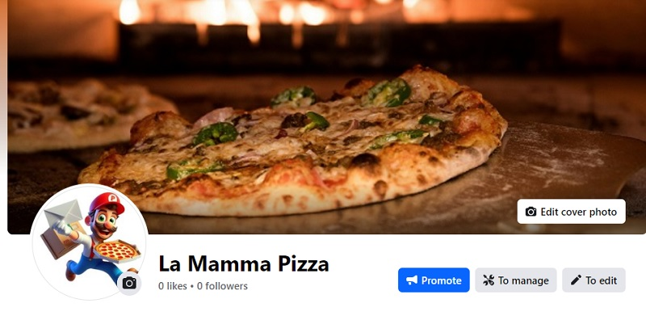

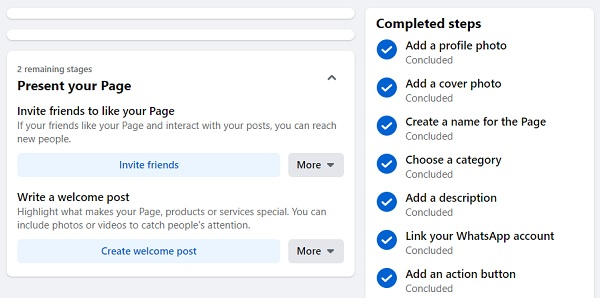

### Email Marketing

Visitors of the website can find a newsletter signup form in the about page where they can fill in their email without any further registration to receive a potential newsletter via email that provides information about sales and new products of the website. The newsletter is handled by MailChimp. For the time being, visitors can enter their email address to signup.

### Favicon

To further enhance the branding, a favicon featuring the Italian flag, representing the company's logo, has been implemented on the website, highlighting its origin in Italian cuisine.

### Robots.txt / Sitemaps.xml

To further enhance the website's SEO ranking, a robots.txt and a sitemap.xml file have been created. The robots.txt file informs search engines to avoid certain areas of the website. The sitemap.xml file was created using the xml-sitemaps.com website to provide a comprehensible understanding of the website's structure to search engines. By having a sitemap.xml file, search engines will crawl every important page on the website which enhances indexing.

# Design

The design of our website reflects the authenticity and charm of Italian cuisine. With a color palette inspired by the vibrant Italian flag, we highlight green, white, and red, creating a warm and familiar atmosphere from the first glance.

Our goal is to provide a visual experience that transports our customers directly to an authentic Italian pizzeria, where every detail is carefully selected to reflect the tradition and quality of our dishes.

Simplicity and elegance are key features of the design, ensuring intuitive navigation and a pleasant experience for users. Menus are organized clearly and concisely, making it easy to view our dishes and delivery options.

In summary, the design of our website pays homage to the rich culinary tradition of Italy, capturing the essence of the country and conveying it to our customers in a captivating and inspiring way.

- The **color palette** was generated on [Coolors co](https://coolors.co/)
  

  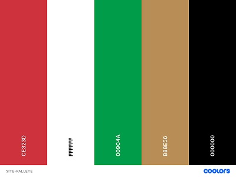

- **Background**

    For the background, an authentic Italian tabletop with kitchen ingredients from **pexels.com** was used.
  
  

## Wireframes

The Balsamiq was used for the layout.

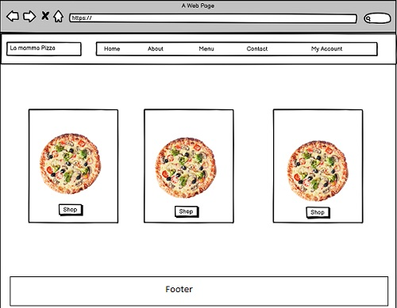

## Database structure

To illustrate my database structure, I used Vision to create an ERD-diagram

For this project, Object-Oriented Programming princiciples and Django's class-based generic views were applied. For the User authentication system, the Allauth library was used. Alongside the models presented in the E-Commerce walkthrough (User, ProfileUser, Product, Order, OrderItem).

## Features

### Base

As this project was made with the Django framework, every page of the website extends its' content from the base.html file, meaning that the content of the base.html is present in every website page. In the following, those features are presented that are extended from the base.html file.

### Navigation Bar

The responsive navigation bar consists of the La Mamma Pizza logo, the navigation menu, and clickable icons, including links to the 'Home', 'About', 'Menu', 'Contact', 'My Account', and 'Checkout' pages. The La Mamma logo serves as a clickable home button that takes users back to the home page. The 'Menu' link includes the product categories of the site (Pizzas and Pastas). If unauthenticated or logged-out users click on the 'My Account' icon, the dropdown menu will display options for 'Register' and 'Login'.

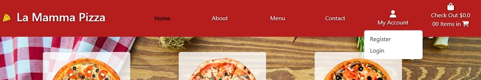

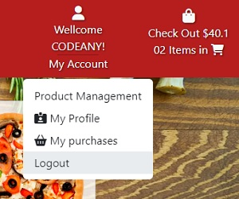

### Register

Users can register for an account by clicking the dropdown menu item 'Register' of the 'My Account' icon. They will be lead to the Register page, where they are asked to enter their email address, a username and a password.
The registration area also includes a link to the login section in case the user already has an account, while the login area also has a link to registration for users who haven't been registered yet.

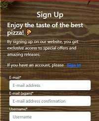

### Login

On the login page, as an additional design element, a pizza icon has been added, maintaining the same template pattern as the register page.

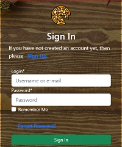

- Once the user is successfully authenticated, they receive an email verification message. Upon confirming this message, the user is then able to access the products and add them to the cart. The email verification message has been personalized with an image of Mario Bros, generated by AI

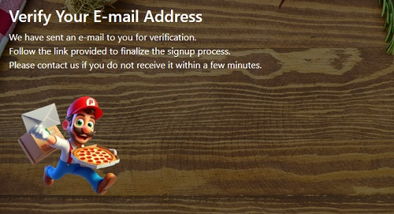

### About

The about page area presents a bit of the company's history and offers users the option to subscribe to our Mailchimp newsletter, as well as access to the Facebook social media link.

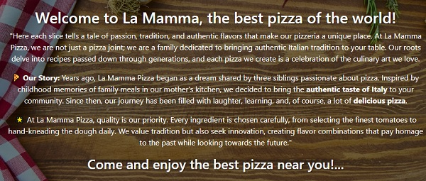

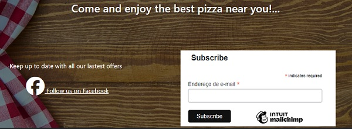

### Contact

On the contact page, a customized frontend form was used, which, along with the contact_page view, the email message module, and Google's SMTP service, offers full functionality. Users can easily contact the company by sending a message directly from the website.

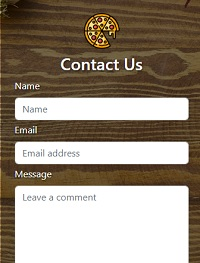

### Logout

Upon clicking the 'logout' link, the user receives a personalized message requesting confirmation for the logout.

### Product Management

As part of the CRUD-functionality, the website admin can create, read, update and delete new products or read, update and delete existing products either in the admin panel or on the front end. To add new products via the frond end, the admin can click on the Product Management dropdown menu option 'Product Management', which will direct the admin to the 'Product Management' page. Here the admin can fill in all fields with the relevant information about the new product to be added.

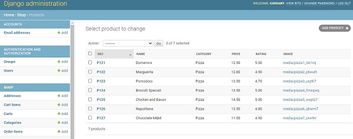

### Custom Error page

A custom template was used as the default 404 error page, featuring an image generated by AI. This template is customized for both the 404 and 500 errors.

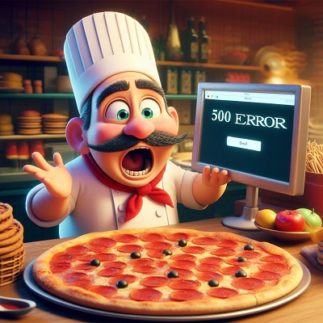

## Tecnologies Used

### Programming Languages

- HTML
- CSS
- Javascript
- Python
- Django

### Work Environments and Hosting

- Visual Studio Code (IDE)
- GitHub (Version Control)
- Heroku (Site Hosting)
- Cloudinary (Serving Static Media Files)

### Frameworks and Libraries

- Django Framework (Python Framework)
- Django Allauth Library (Authentication)
- Crispy Forms (Django Forms)
- Bootstrap 4.4.1 (HTML & CSS Framework)
- Psycopg2 (PostgreSQL Database adapter)
- Gunicorn (Python HTTP server for WSGI applications)

### Database

- Elephant SQL (PostgreSQL Database Hosting)

### Deployment

This project was deployed using Heroku, Cloudinary and ElephantSQL.

**Installing libraries**

The following steps outline all libraries needed for successful deployment on Heroku. All neccessary-requirements and settings updates will not be discussed in this section as they are assumed as logical follow-up steps to installments. For a full explanation of how to install these libraries, refer to the links provided in Technologies Used.

- Install Gunicorn (server used to run Django on Heroku): pip3 install django gunicorn
- Install pyscopg2 (connects to PostgreSQL): pip 3 install dj_database_url pyscopg2
- Install Cloudinary (host static files and images): pip3 install dj3-Cloudinary-storage
  
**Creating the Heroku App**

- Log into Heroku and go to the Dashboard
- Click New and select Create new app from the drop-down
- Name the app appropriately and choose the relevant region, then click Create App
  
**Create a PostgreSQL database using ElephantSQL**

This is necessary to create a database that can be accessed by Heroku. The database provided by Django can not be accessed by the deployed Heroku app.

- Log into ElephantSQL and go to Dashboard
- Click Create New Instance
- Set up a plan by providing a Name (project name) and select a Plan (for this project the free plan "Tiny Turtle" was chosen). Tags are optional.
- Click Select Region and choose appropriate Datacenter
- Click Review, check all details and click Create Instance
- Return to Dashboard on click on the name of the newly created instance
- Copy the database URL from the details section

**Hiding sensitive information**

- Create env.py file and ensure it is included in the .gitignore file
- Add import os to env.py file and set environment variable DATABASE_URL to the URL copied from ElephantSQL (os.environ["DATABASE_URL"]="<copiedURL>")
- Below, set SECRET_KEY variable (os.environ["SECRET_KEY"]="mysecretkey", but be more inventive about the key string!)

**Update Settings**

- Add the following code at the top of settings.py to connect the Django project to env.py:

  import os
  import dj_database_url
  if os.path.isfile('env.py'):
      import env
- Remove the insecure secret key provided by Django in settings.py and refer to a variable in env.py instead (SECRET_KEY = os.environ.get('SECRET_KEY'))

- To connect to the new database, replace the provided DATABASE variable with

DATABASES = {
    'default': dj_database_url.parse(os.environ.get("DATABASE_URL"))
}
- Save and migrate all changes made

**Connecting Heroku to Database**

- In the Heroku dashboard, go to Settings tab
- Add new config vars CLOUDINARY_URL (value is CLOUDINARY_URL), DATABASE_URL (value is database URL), HEROKU_HOSTNAME (value is Heroku app), SECRET_KEY (value is secret key string) and PORT (value "8000")

**Connect to Cloudinary**

- In the Cloudinary dashboard, copy API Environment variable
- In env.py file, add new variable os.environ["CLOUDINARY_URL"] = "<copied_variable" and remove CLOUDINARY_URL= from the variable string
- Add same variable value as new Heroku config var named CLOUDINARY_URL
- In settings.py, in INSTALLED_APPS list, above django.contrib.staticfiles add cloudinary_storage, below add cloudinary
- To define Cloudinary as static file storage add the following to settings.py
STATICFILES_STORAGE = 'cloudinary_storage.storage.StaticHashedCloudinaryStorage'
DEFAULT_FILE_STORAGE = 'cloudinary_storage.storage.MediaCloudinaryStorage'

**Allow Heroku as host**

- In settings.py add
ALLOWED_HOSTS = ['app-name.herokuapp.com', 'localhost']

## Development

### Clone

Changes made to a cloned repository will affect the original one.

- Navigate to the main page of the repository (this could be a forked instance)
- Click on the Code dropdown menu above the list of files
- Choose a method to copy the URL for the repository: either via HTTPS, by using an SSH key, or by using GitHub CLI
- In your work environment, open Git Bash and change the current directory to the target location for the cloned repository
- Type git clone followed by the copied URL and press enter Enter

### Download as ZIP

- Log into GitHub and click on the repository to download (RetroResell )
- Select Code and click "Download Zip" file
- Once the download is completed, extract the ZIP file and use it in your local environment

## Credits

### Images

- All images were obtained through the website pexels.com or generated using AI.

  

  
  

  

  

