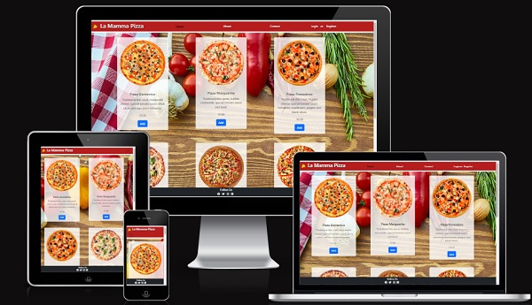

# La MAMMA Pizza

La Mamma is an online fast food delivery B2C store, inspired by Italian cuisine, specializing in pizzas and pasta. It was built using the Django and Bootstrap frameworks.
The project was conceived entirely as an original creation, with no replication of the Boutique Ado project.

Italian cuisine, along with its colors, themes, and decorations, served as the sole inspiration for the entire design.

Authenticated users can browse through the menu, explore the flavors of pizzas, ingredients, sizes, and prices.

The project was designed to convey to the user the experience of an authentic Italian pizzeria, with carefully selected ingredients and unique flavors, making La Mamma the best pizzeria in town.

The live link can be found here - [La MAMMA Pizza](https://myecommerce-f6b06812eb2a.herokuapp.com/)

## Planning

